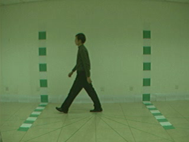
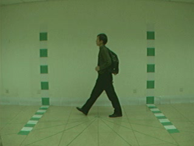
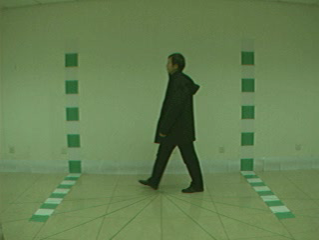

# [CASIA Gait Database B](http://www.cbsr.ia.ac.cn/english/Gait Databases.asp)

CASIA dataset was created in 2005 and originally used to test gait recognition algorithm. In 2015, Liu et.al reused this dataset to test a gait-based person re-identification algorithm. This dataset is collected by 11 overlapped cameras in different view angles from 0 to 180 degree. Each identity also changes the clothing and carrying condition. Instead of providing bounding boxes, the raw video frames and the silhouette of each frame are given.

# 简介

CASIA数据集创建于2005年，最初用于测试步态识别算法。2015年，Liu等人利用该数据集测试了一种基于步态的人再识别算法。该数据集是由11个重叠相机在0到180度的不同视角下采集的。每个身份还会改变着装和携带条件。不提供边界框，而是给出原始视频帧和每个帧的剪影。

