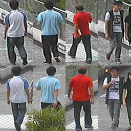

# [CUHK02](http://www.ee.cuhk.edu.hk/~xgwang/CUHK_identification.html)

CUHK02 is an extended dataset from CUHK01. Besides the camera pair in CUHK01, it has four more camera pair settings.

# 简介

CUHK02是CUHK01的扩展数据集。除了CUHK01中的相机对外，它还有四个相机对设置。

1816个身份，7264个图像，手动裁剪

取自5个不同的户外camera对，共1816人。5个camera对分别有971,306,107,193,239人，大小160*60. 每个人在每个摄像机下的不同时间内取两张图片。大多数人都有负重（背包，手提包，皮带包，行李）。 

Download：[链接](http://www.ee.cuhk.edu.hk/~xgwang/CUHK_identification.html)

> W. Li and X. Wang, "[Locally Aligned Feature Transforms across Views](https://www.cv-foundation.org/openaccess/content_cvpr_2013/papers/Li_Locally_Aligned_Feature_2013_CVPR_paper.pdf)" in Proceedings of IEEE Computer Society Conference on Computer Vision and Pattern Recognition (CVPR) 2013.