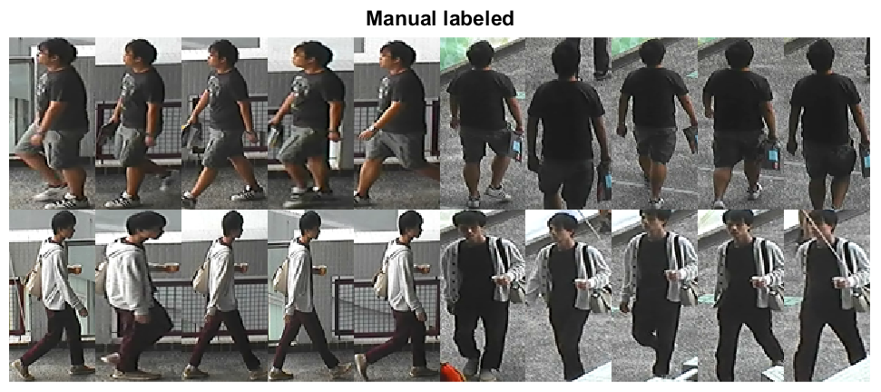
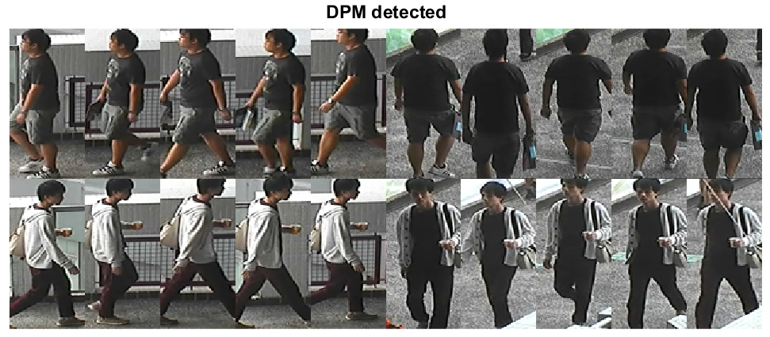

# [CUHK03](http://www.ee.cuhk.edu.hk/~xgwang/CUHK_identification.html)

CUHK03 is the first person re-identification dataset that is large enough for deep learning. It provides the bounding boxes detected from deformable part models (DPM) and manually labeling. Person detection quality is relatively good for this dataset.

# 简介

CUHK03是第一个足以进行深度学习的重新识别数据集。它提供从 Deformable Part Model （DPM）检测到的边界框和手动标记。对于该数据集，人物检测质量相对较好。

1467 个身份，13164个图像，手动裁剪+自动检测

Download：[链接](https://pan.baidu.com/s/11tZoxusQsOU629iTWXQ8BA)   提取码：tegi

 

> Li, W., Zhao, R., Xiao, T., & Wang, X. (2014). Deepreid: [Deep filter pairing neural network for person re-identification](https://www.cv-foundation.org/openaccess/content_cvpr_2014/papers/Li_DeepReID_Deep_Filter_2014_CVPR_paper.pdf). In Proceedings of the IEEE Conference on Computer Vision and Pattern Recognition (pp. 152-159).

