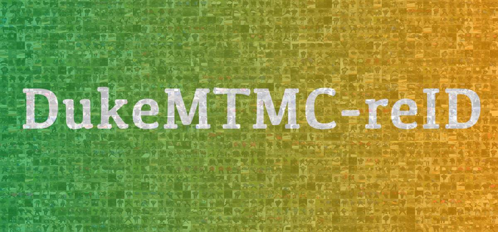
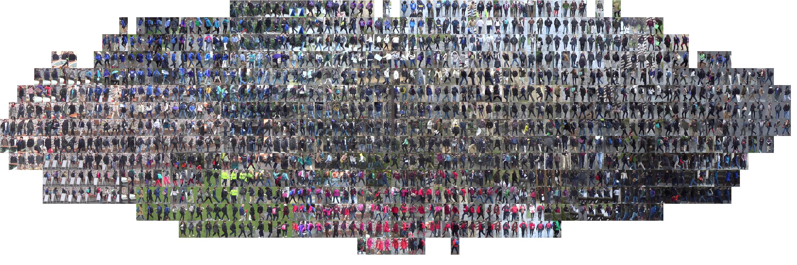

# [DukeMTMC-reID/DukeMTMC4ReID](http://vision.cs.duke.edu/DukeMTMC/)

The DukeMTMC dataset is a large-scale heavily labeled multi-target multi-camera tracking dataset. In total, more than 2700 people were labeled with unique identities in 8 cameras. With the access to all information (full frames, frame level ground truth, calibration information, etc.), this dataset has a lot of protentials. Based on the released train-validation set, two re-id extension datasets are created. The key difference is the way to generate the bounding boxes. DukeMTMC-reID directly uses the manually labeled ground truth whereas DukeMTMC4ReID adopts Doppia as the person detector.

# 简介

原始数据集包含了85分钟的高分辨率视频，采集自8个不同的摄像头。并且提供了人工标注的bounding box 该数据集一共 36,411张图像。其中有1,404个人出现在大于两个摄像头下，有408个人只出现在一个摄像头下。

随机采样了 702 个人作为**训练集**，702个人作为**测试集**。在**测试集中**，我们采样了**每个ID的每个摄像头下的一张照片**作为查询图像（**query**）。剩下的图像加入测试的搜索库（gallery），并且将之前的 408人作为干扰项，也加到 gallery中。最终，**训练集中，**DukeMTMC-reID 包含了 16,522张训练图片（来自702个人），**测试集中**： 2,228个查询图像（来自另外的702个人），以及 17,661 张图像的搜索库（gallery）。并提供切割后的图像供下载。

另外，DukeMTMC-reID还提供了23种属性数据标注 DukeMTMC-attribute供下载。 https://github.com/vana77/DukeMTMC-attribute

#### DukeMTMC-reID

> Zheng, Zhedong, Liang Zheng, and Yi Yang. ["Unlabeled samples generated by gan improve the person re-identification baseline in vitro."](https://arxiv.org/pdf/1701.07717.pdf) arXiv preprint arXiv:1701.07717 (2017).

#### DukeMTMC4ReID

> Gou, Mengran and Karanam, Srikrishna and Liu, Wenqian and Camps, Octavia and Radke, Richard J. "[DukeMTMC4ReID: A Large-Scale Multi-Camera Person Re-Identification Dataset](http://robustsystems.coe.neu.edu/sites/robustsystems.coe.neu.edu/files/systems/papers/MengranGou_CVPRW17.pdf)." CVPR Workshops (2017)

