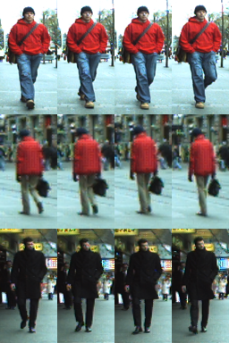

# [ETH1,2,3](http://homepages.dcc.ufmg.br/~william/datasets.html)

Different from other datasets collecting images from multiple cameras, ETHZ collects images from a moving camera. Although the viewpoint variance is relatively small, it does have considerable illumination variance, scale variance and occlusion.

# 简介

不同于其他从多个摄像机收集图像的数据集，ETHZ从一个移动的摄像机收集图像。 虽然视点方差相对较小，但它确实有相当大的光照方差、尺度方差和遮挡。  

>W.R. Schwartz, L.S. Davis. "[Learning Discriminative Appearance-Based Models Using Partial Least Squares](http://users.umiacs.umd.edu/~lsd/papers/paperSibgrapi09.pdf)".Proceedings of the XXII Brazilian Symposium on Computer Graphics and Image Processing (SIBGRAPI'2009), Rio de Janeiro, Brazil, October 11-14, 2009.

