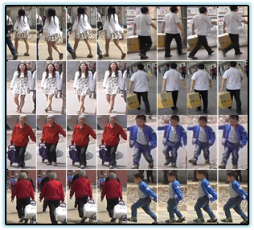

# [LPW](http://liuyu.us/dataset/lpw/index.html)

Labeled Pedestrian in the Wild is a video based re-id dataset. It's collected in three scenes on the street. The identities include adults and children and the poses vary from running to cycling. The dataset has been manually cleaned up to remove failed detections and tracklets.

# 简介

是一个基于视频的重新识别数据集。它被收集在街上的三个场景中。他们的身份包括成人和儿童，姿势从跑步到骑自行车不一而足。该数据集已被手动清理，以删除失败的检测和小轨迹。

> Guanglu Song, Biao Leng, Yu Liu, Congrui Hetang, Shaofan Cai. "[Region-based Quality Estimation Network for Large-Scale Person Re-identification](https://www.researchgate.net/publication/321306951_Region-based_Quality_Estimation_Network_for_Large-scale_Person_Re-identification)." AAAI (2018)