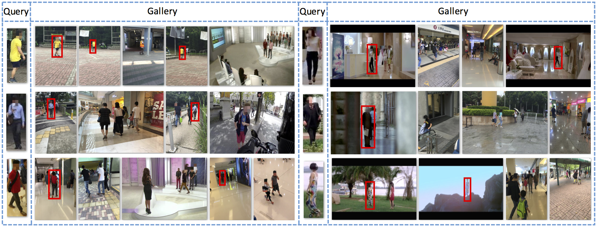

# [Large scale person search](http://www.ee.cuhk.edu.hk/~xgwang/PS/dataset.html)

Similar to PRW dataset, the person search dataset is large scale dataset with full frame access and large amount of labeled bounding boxes. It aims to mimic the real scenario of person search. Therefore, to test this dataset, a reliable person detector is needed. To make the dataset more difficult, the gallery part includes frames from hand held camera and movies. Two more subsets, low-resolution subset and occlusion subset, are also released to evalution the affect of those factors.

# 简介

与PRW数据集类似，人员搜索数据集是具有全帧访问和大量标记边框的大规模数据集。它的目的是模拟个人搜索的真实场景。因此，为了测试这个数据集，需要一个可靠的人检测器。为了使数据集更加困难，画廊部分包括来自手持相机和电影的帧。另外还发布了两个子集，即低分辨率子集和遮挡子集，以评价这些因素的影响。

> Xiao, T., Li, S., Wang, B., Lin, L., & Wang, X. (2016). [End-to-End Deep Learning for Person Search](https://www.researchgate.net/publication/301875757_End-to-End_Deep_Learning_for_Person_Search). arXiv preprint arXiv:1604.01850.

