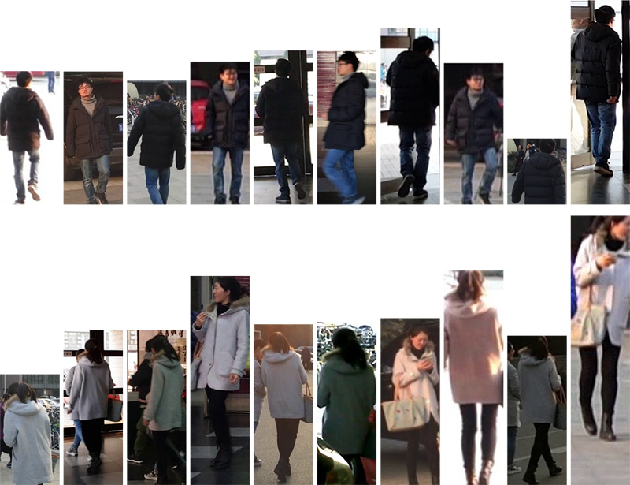

# [MSMT17](http://www.pkuvmc.com/publications/msmt17.html)

This large scale re-id dataset is collected in a campus with 12 outdoor cameras and 3 indoor cameras. It coveres 4 days with different weather in a month. For each day, 3 one-hour videos are selected from morning, noon and afternoon. Faster RCNN is utilized for pedestrian detection. This dataset is the largest re-id dataset so far. It has similar viewpoint with Market, but much more complicated scenarios.

# 简介

这个大规模的re-id数据集是在一个校园里收集的，有12个室外摄像机和3个室内摄像机。它涵盖了4天不同的天气在一个月。每天从上午、中午和下午选择3个时长1小时的视频。采用更快的RCNN进行行人检测。此数据集是迄今为止最大的re-id数据集。它的观点与Market类似，但情况要复杂得多。

# MSMT17对比之前数据的优点

1）数目更多的行人、包围框、摄像头数：MSMT17包含126,441个边界框，4101个身份，比以前的数据集大很多。

2）复杂的场景和背景：MSMT17包含的摄像机数量最多，即，15个摄像头被放置在不同的地方。它还由室内和室外的视频构成，这在以前的数据集中没有考虑到。这些考虑导致复杂的背景和场景变化，也使MSMT17更有吸引力和挑战性。

3）涵盖多时段，因此有复杂的光照变化：收集MSMT17有12个时间段，即四天后是上午、中午和下午。它比以前的数据集更好地模拟真实场景，但带来了严重的照明变化。

4）更可靠的bouning box探测器：与手工标注和DMP标注相比， Faster RCNN在实际应用中为提供了更快的选择，如更容易实现和更准确。

# 评估协议

​        按照训练-测试为1：3的比例对数据集进行随机划分，而不是像其他数据集一样均等划分。这样做的目的是鼓励高效率的训练策略，由于在真实应用中标注数据的昂贵。

   最后，训练集包含1041个行人共32621个包围框，而测试集包括3060个行人共93820个包围框。对于测试集，11659个包围框被随机选出来作为query，而其它82161个包围框作为gallery.

​     测试指标为CMC曲线和mAP. 对于每个query, 可能存在多个正匹配。

> Wei, L., Zhang, S., Gao, W., & Tian, Q. (2018). [Person Transfer GAN to Bridge Domain Gap for Person Re-Identification](https://arxiv.org/pdf/1711.08565.pdf). Computer Vision and Pattern Recognition, IEEE International Conference on, 2018

