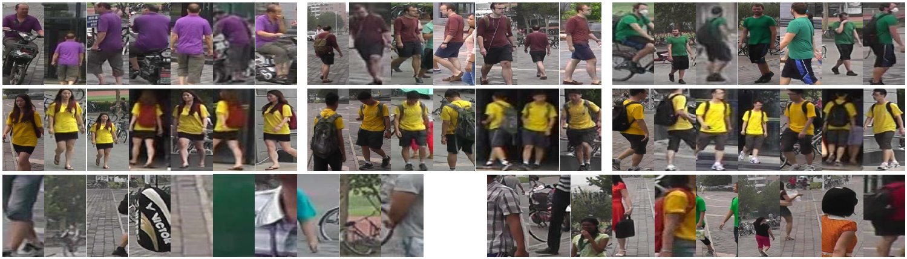

# [Market1501](http://www.liangzheng.com.cn/Project/project_reid.html)

It contains a large number of identities and each identity has several images from six dis-joint cameras. This dataset also includes 2793 false alarms from DPM as distractors to mimic the real scenario. Quality of the bounding boxes is worse than CUHK03. Later in the ICCV 2015 release version, 500K distractors are integrated to make this dataset really large scale. In the original paper proposed this dataset, the author also used mAP as an evalution criteria to test the algorithms.

# 简介

Market-1501数据集收集共使用了六台摄像机。该数据集包含32,668个带有1,501个身份的带注释的边界框。确保每个带注释的标识出现在至少两个摄像机中，以便可以执行跨摄像机搜索。

我们的数据集采用 Deformable Part Model (DPM) 作为行人检测器。每个识别可以在每个相机下具有多个图像。在跨摄像机搜索期间，每个身份都有多个queries 和多个ground truths 。

该软件包包含四个文件夹。
1）“bounding_box_test”。此文件夹中有19,732个图像用于测试。
2）“bounding_box_train”。此文件夹中有12,936个图像用于训练。
3）“query” 。有750个身份。我们为每个摄像机随机选择一个查询图像。因此，身份的最大query 图像数为6。总共有3,368个query 图像在此文件夹中。
4）“gt_query”。此文件夹包含ground truth annotations。对于每个查询，相关图像被标记为“好”或“垃圾”。“垃圾”对搜索准确性没有任何影响。“垃圾”图像还包括与query相同的相机中的图像。
5）“gt_bbox”。我们还提供手绘边框。它们用于判断DPM边界框是否良好。

## 目录结构

Market-1501
　　├── bounding_box_test
　　　　　　　├── 0000_c1s1_000151_01.jpg
　　　　　　　├── 0000_c1s1_000376_03.jpg
　　　　　　　├── 0000_c1s1_001051_02.jpg
　　├── bounding_box_train
　　　　　　　├── 0002_c1s1_000451_03.jpg
　　　　　　　├── 0002_c1s1_000551_01.jpg
　　　　　　　├── 0002_c1s1_000801_01.jpg
　　├── gt_bbox
　　　　　　　├── 0001_c1s1_001051_00.jpg
　　　　　　　├── 0001_c1s1_009376_00.jpg
　　　　　　　├── 0001_c2s1_001976_00.jpg
　　├── gt_query
　　　　　　　├── 0001_c1s1_001051_00_good.mat
　　　　　　　├── 0001_c1s1_001051_00_junk.mat
　　├── query
　　　　　　　├── 0001_c1s1_001051_00.jpg
　　　　　　　├── 0001_c2s1_000301_00.jpg
　　　　　　　├── 0001_c3s1_000551_00.jpg
　　└── readme.txt

## 目录介绍

1） “bounding_box_test”——用于测试集的 750 人，包含 19,732 张图像，前缀为 0000 表示在提取这 750 人的过程中DPM检测错的图（可能与query是同一个人），-1 表示检测出来其他人的图（不在这 750 人中）
2） “bounding_box_train”——用于训练集的 751 人，包含 12,936 张图像
3） “query”——为 750 人在每个摄像头中随机选择一张图像作为query，因此一个人的query最多有 6 个，共有 3,368 张图像
4） “gt_query”——matlab格式，用于判断一个query的哪些图片是好的匹配（同一个人不同摄像头的图像）和不好的匹配（同一个人同一个摄像头的图像或非同一个人的图像）
5） “gt_bbox”——手工标注的bounding box，用于判断DPM检测的bounding box是不是一个好的box

## 图像命名规则

在bbox“0001_c1s1_001051_00.jpg”中，“c1”是第一个摄像头（共有6个摄像头）。

“s1”是摄像机1的序列1。这里的序列是由摄像机自动定义的。我们假设相机无法存储相当大的整个视频，因此它将视频分成同样大的序列。两个序列，即“c1s1”和“c2s1”并不完全同时发生。这主要是因为6台摄像机的启动时间不完全相同（打开它们需要时间）。但是，“c1s1”和“c2s1”大致处于同一时期。

“001051”是序列“c1s1”中的第1051帧。帧速率为每秒25帧。

与最后两位数字一样，请记住我们使用DPM检测器。然后，对于标识“0001”，在帧“c1s1_001051”中可能存在多个检测到的边界框。换句话说，图像中的行人可以通过DPM具有多个bbox。因此，“00”表示此边界框是几个中的第一个。

Download：[链接](https://pan.baidu.com/s/1M5Q1j3895SG86DgmTwk2wg)   提取码：nfw5

> Zheng, L., Shen, L., Tian, L., Wang, S., Wang, J., & Tian, Q. (2015). [Scalable person re-identification: A benchmark](https://www.researchgate.net/publication/300412402_Scalable_Person_Re-identification_A_Benchmark). In Proceedings of the IEEE International Conference on Computer Vision (pp. 1116-1124).

