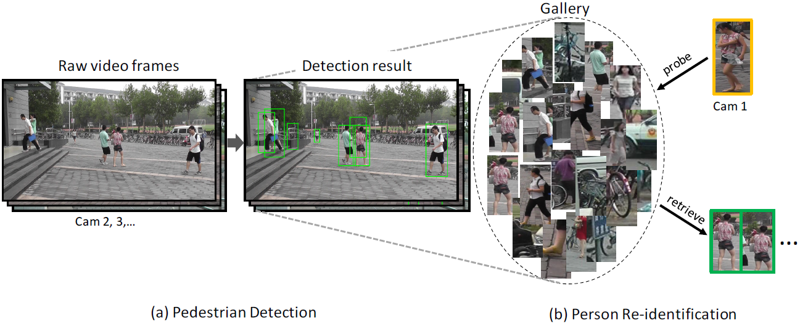

# [PRW](http://www.liangzheng.org/Project/project_prw.html)

The PRW (Person Re-identification in the Wild) dataset is an extenstion of Maretk1501 dataset. Instead of only provide bounding boxes, the author released the full frames with annotations. Therefore one can evaluate the affact of different person detectors.

# 简介

PRW (Person Re-identification in The Wild)数据集是martk1501数据集的扩展。除了提供边界框之外，作者还发布了带有注释的完整框架。因此，可以评估不同的人探测器的影响。

> Zheng, L., Zhang, H., Sun, S., Chandraker, M., & Tian, Q. (2016). [Person Re-identification in the Wild](https://www.researchgate.net/publication/301875682_Person_Re-identification_in_the_Wild). arXiv preprint arXiv:1604.02531.

