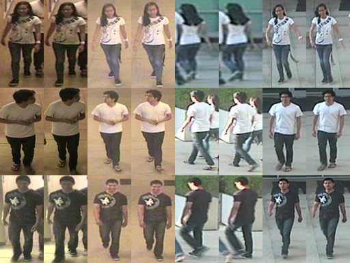

# [RAiD](http://cs-people.bu.edu/dasabir/raid.php)

As a relatively new released dataset, RAiD guaranteed each identity has images in all four non-overlaping cameras. Since two cameras are indoor and the other two are outdoor, the illumination variance is considerably large. Images of each identity are collected in a tracking manner, but the order is not always consistent.

# 简介

作为一个相对较新的数据集，RAiD保证每个身份在所有四个不重叠的摄像机中都有图像。由于两个摄像头在室内，另外两个在室外，照明差异相当大。每个身份的图像都以跟踪的方式收集，但顺序并不总是一致的。

> Das, A., Chakraborty, A., & Roy-Chowdhury, A. K. (2014, September). [Consistent re-identification in a camera network](http://cs-people.bu.edu/dasabir/papers/ECCV14_Poster.pdf). In European Conference on Computer Vision (pp. 330-345). Springer International Publishing.