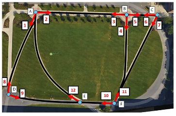

# [RPIfield](https://drive.google.com/file/d/1GO1zm7vCAJwXgJtoFyUs367_Knz8Ev0A/view?usp=sharing)

RPIfield is a new re-id dataset, which provides explicit time-stamp information for each person, thus helping evaluate re-id algorithms based on their temporal performance on a dynamic gallery populated by an increasing number of candidates (some of whom may return several times over a long duration).

# 简介

RPIfield是一个新的re-id数据集，它为每个人提供显式的时间戳信息，从而帮助评估re-id算法在由越来越多的候选对象(其中一些人可能在很长一段时间内返回多次)填充的动态图库上的时间性能。

> Zheng, Meng and Karanam, Srikrishna and Radke, Richard J. ["RPIfield: A New Dataset for Temporally Evaluating Person Re-Identification."](https://www.researchgate.net/publication/329748312_RPIfield_A_New_Dataset_for_Temporally_Evaluating_Person_Re-identification) CVPR Workshops (2018)