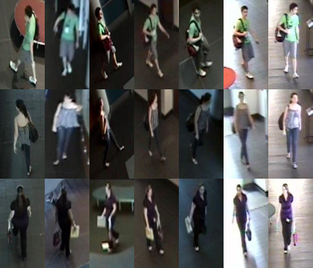

# [SAIVT-Softbio](https://researchdatafinder.qut.edu.au/display/n27416)

SAIVT-Softbio is collected by eight existing surveillance cameras. Since it's an uncontrolled collection, most identities only pass through a subset of cameras. This dataset also provides the whole video frames with labeled bounding box on every frame, but the bounding boxes are not very tight for some instances.

# 简介

SAIVT - Softbio由8个现有的监控摄像头收集。由于这是不受控制的收集，大多数身份只能通过一部分摄像头。该数据集还提供了整个视频帧的标签边界框在每一帧，但边界框不是非常紧密的一些实例。

> Bialkowski, Alina, Denman, Simon, Lucey, Patrick, Sridharan, Sridha, & Fookes, Clinton B. (2012) [A database for person re-identification in multi-camera surveillance networks](https://core.ac.uk/download/pdf/10913114.pdf). In Proceedings of the 2012 International Conference on Digital Image Computing Techniques and Applications (DICTA 12), IEEE, Esplanade Hotel, Fremantle, WA, pp. 1-8.

