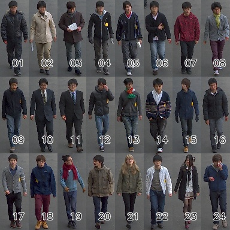

# [Shinpuhkan Dataset](http://www.mm.media.kyoto-u.ac.jp/en/datasets/shinpuhkan/)

Shinpuhkan dataset was orginally created to test multi-camera tracking methods. Each person has multiple tracklets in different directions within each camera. In total, each identity has 86 annotated tracklets. The image quality seems fairly good comparing with other tranditional re-id datasets.

# 简介

Shinpuhkan数据集最初是为了测试多摄像机跟踪方法而创建的。每个人在每个相机中有多个不同方向的小轨迹。每个身份总共有86个注释的小轨道。与其他传统的再识别数据集相比，图像质量似乎相当好。

> Kawanishi, Y., Wu, Y., Mukunoki, M., & Minoh, M. (2014). [Shinpuhkan2014: A multi-camera pedestrian dataset for tracking people across multiple cameras](https://www.researchgate.net/publication/266914646_Shinpuhkan2014_A_Multi-Camera_Pedestrian_Dataset_for_Tracking_People_across_Multiple_Cameras). In 20th Korea-Japan Joint Workshop on Frontiers of Computer Vision (Vol. 5, p. 6).