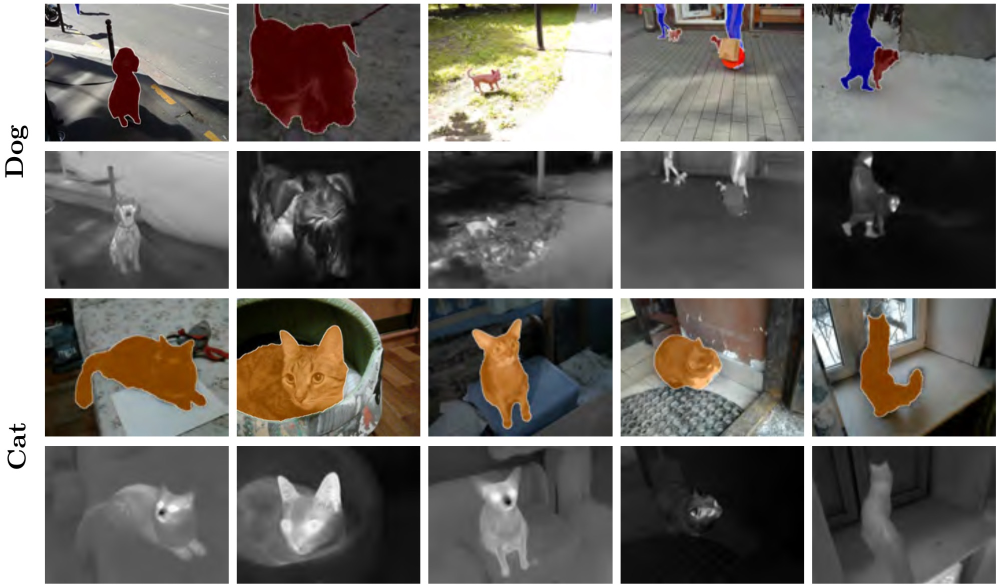

# [ThermalWorld](http://www.zefirus.org/ThermalGAN/)

This is a cross-modality re-id dataset with thermal-color image pairs. Pixel level annotations are provided.

# 简介

这是一个跨模态的重新识别数据集与热彩色图像对。提供像素级注释。

> Kniaz, Vladimir V. and Knyaz, Vladimir A. and Hladuvka, Jiri and Kropatsch, Walter G. and Mizginov, Vladimir A. ["ThermalGAN: Multimodal Color-to-Thermal Image Translation for Person Re-Identification in Multispectral Dataset."](https://www.researchgate.net/publication/330585294_ThermalGAN_Multimodal_Color-to-Thermal_Image_Translation_for_Person_Re-identification_in_Multispectral_Dataset_Munich_Germany_September_8-14_2018_Proceedings_Part_VI) ECCV Workshop (2018)

