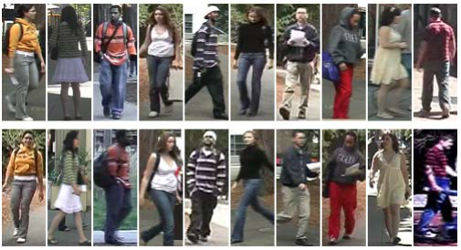

# [VIPeR](https://vision.soe.ucsc.edu/node/178)

This dataset contains two cameras, each of which captures one image per person. It also provides the viewpoint angle of each image. Note the wide range of viewpoint, pose, and illumination changes. Although it has been tested by many researchers, it's still one of the most challenging datasets. Ryan Layne provides the attribute annotation of VIPeR here.

## 简介

该数据集包含两个摄像头，每个摄像头每人捕获一个图像。它还提供每个图像的视点角度。虽然它已经过许多研究人员的测试，但它仍然是最具挑战性的数据集之一。632人，2个户外摄像头，有多种姿态，视角和光照变化。每个人在每个摄像机下有一张图像，尺度为128*48。提供的角度0度（front），45度，90度（right）,135度，180（back） 

Download: [[baidu](https://pan.baidu.com/s/1XgdC0MuX1QNtQI81hdb3Xg)] (code: e80b)

>D. Gray and Tao, H., [“Viewpoint Invariant Pedestrian Recognition with an Ensemble of Localized Features”](https://link.springer.com/content/pdf/10.1007/978-3-540-88682-2_21.pdf), in ECCV '08: Proceedings of the 10th European Conference on Computer Vision, Berlin, Heidelberg, 2008, pp. 262–275.
>
>D. Gray, Brennan, S., and Tao, H., [“Evaluating Appearance Models for Recognition, Reacquisition, and Tracking”](https://citeseerx.ist.psu.edu/viewdoc/download?doi=10.1.1.331.7285&rep=rep1&type=pdf), in 10th IEEE International Workshop on Performance Evaluation of Tracking and Surveillance (PETS), 2007.

