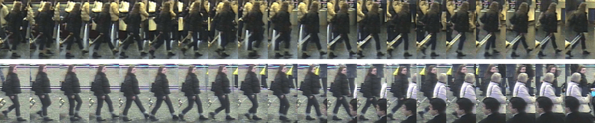
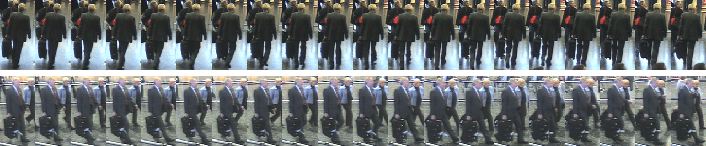
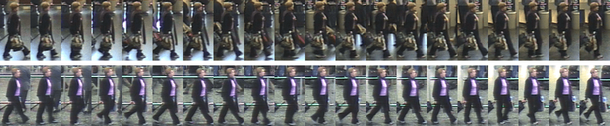

# [iLIDS-VID](http://www.eecs.qmul.ac.uk/~xiatian/downloads_qmul_iLIDS-VID_ReID_dataset.html)

Based on the assumption that the real person re-identification system should have the trajectory for each identity, iLIDS-VID dataset extracted 600 trajectories for 300 identities from iLIDS MCTS dataset. Due to the limitation of iLIDS MCTS dataset, iLIDS-VID has extremely heavy occlusion.

# 简介

基于真人再识别系统应该有每个身份的轨迹的假设，iLIDS- vid数据集从iLIDS MCTS数据集中提取了300个身份的600条轨迹。由于iLIDS MCTS数据集的局限性，iLIDS- vid具有极其严重的遮挡。

iLIDS-VID数据集涉及在公共开放空间中的两个不相交的摄像机视图中观察到的300个不同的行人。包含两个版本：基于静态图像（参见名为“ILIDS-VID \ images”的文件夹）和基于图像序列（参见名为“ILIDS-VID \ sequences”的文件夹）。

取自监控航空接站大厅，从2个不相交摄像机创建该数据集。随机为300个人采样了600个视频，每人有来自两个视觉的一对视频。每个视频有23~192帧，平均73帧。相似的衣服、光照和视觉改变，复杂的背景和严重的遮挡，很具挑战性。

Download：[链接](https://pan.baidu.com/s/1cmuyHFXplnnw9OHZuHXgNw)   提取码：exuf

  

> Wang, T., Gong, S., Zhu, X., & Wang, S. (2016). [Person Re-Identification by Discriminative Selection in Video Ranking](https://www.researchgate.net/publication/292188035_Person_Re-Identification_by_Discriminative_Selection_in_Video_Ranking).

